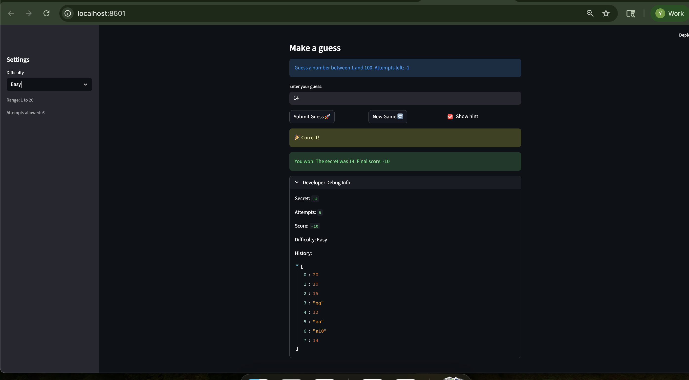

# 🎮 Game Glitch Investigator: The Impossible Guesser

## 🚨 The Situation

You asked an AI to build a simple "Number Guessing Game" using Streamlit.
It wrote the code, ran away, and now the game is unplayable. 

- You can't win.
- The hints lie to you.
- The secret number seems to have commitment issues.

## 🛠️ Setup

1. Install dependencies: `pip install -r requirements.txt`
2. Run the broken app: `python -m streamlit run app.py`

## 🕵️‍♂️ Your Mission

1. **Play the game.** Open the "Developer Debug Info" tab in the app to see the secret number. Try to win.
2. **Find the State Bug.** Why does the secret number change every time you click "Submit"? Ask ChatGPT: *"How do I keep a variable from resetting in Streamlit when I click a button?"*
3. **Fix the Logic.** The hints ("Higher/Lower") are wrong. Fix them.
4. **Refactor & Test.** - Move the logic into `logic_utils.py`.
   - Run `pytest` in your terminal.
   - Keep fixing until all tests pass!

## 📝 Document Your Experience

- [x ] Describe the game's purpose.
After user submit a guess, debugged game should give user hint whether to go higher or lower. If user can guess the right number within 8 tries, user wins. Otherwise, user loses. 
- [x ] Detail which bugs you found.
   --when guess is greater than secret, hint says 'Go Higher';when guess is smaller than secret, hint says 'go lower'. Hint should say "Go higher" when guess is smaller than secret, and say "Go lower" when guess is bigger than secret.
   --“New Game” only reset attempts and secret, leaving score, history, and the hint checkbox state in st.session_state, so the debug panel and hint behavior carried over.
   --History in developer debugger lags one element behind submission. For example, after first submission, history still shows [], after second submission, history shows[0:value]. At the end of the game or when user stops playing, history does not record the last submission. History should record each submission and all submission.
- [x ] Explain what fixes you applied.
--Fixed the hint direction in check_guess() so high guesses prompt “Go Lower” and low guesses prompt “Go Higher.”
--Updated the new-game reset to clear score/history, restore playing status, and re-enable hints.
--Moved the “Developer Debug Info” expander to render after the submission logic, so it reflects the latest history and no longer lags a step behind. The lag was due to the debug block being rendered before the submit handling ran in the same Streamlit rerun.

## 📸 Demo

- [ x] [Insert a screenshot of your fixed, winning game here]

## 🚀 Stretch Features

- [ ] [If you choose to complete Challenge 4, insert a screenshot of your Enhanced Game UI here]
