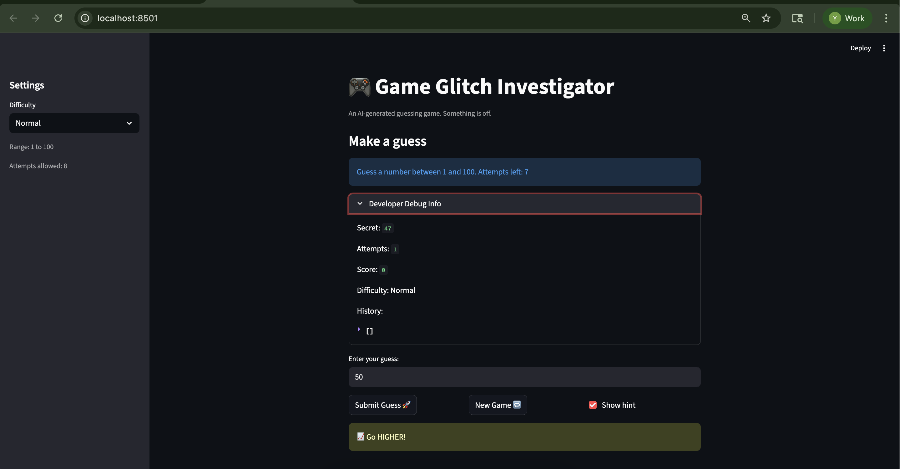

# 💭 Reflection: Game Glitch Investigator

Answer each question in 3 to 5 sentences. Be specific and honest about what actually happened while you worked. This is about your process, not trying to sound perfect.

## 1. What was broken when you started?

- What did the game look like the first time you ran it?

- List at least two concrete bugs you noticed at the start  
  (for example: "the secret number kept changing" or "the hints were backwards").
  --when guess is greater than secret, hint says 'Go Higher', which is incorrect. Hint should say 'Go Lower' when guess is greater than secret.
  --when guess is smaller than secret, hint says 'go lower', which is incorrect. Hint should say 'Go Higher' when guess is smaller than secret.
  --when start a new game after an old game is over, default score in developer debug info still shows score and history from old game. After 'start a new game' button is clicked, default score in developer debug info should show 0, history should show [].
  --when start a new game after an old game is over, there is no hint. Hint stays as when the old game is over. When a new game starts, user should be able to see hint after each submission. 
  --History in developer debugger lags one element behind submission. For example, after first submission, history still shows [], after second submission, history shows[0:value]. At the end of the game or when user stops playing, history does not record the last submission. History should record each submission and all submission.
  --History does not record every submission. History only records submission of even numbers. For example, when secret is 61, and user submits every number starting from 20 to 34, history only records even numbers of 20, 22,..History should record all submission.
  --When user enters input that is not a number, although history records the input, when attempts already exceeds 8, games keeps going. Attempts should increase by one after each submission, and game should end when attampts exceed 8. 

---

## 2. How did you use AI as a teammate?

- Which AI tools did you use on this project (for example: ChatGPT, Gemini, Copilot)?
--ChatGpT-5.2-Codex
- Give one example of an AI suggestion that was correct (including what the AI suggested and how you verified the result).
--Fixed the hint direction in check_guess() so high guesses prompt “Go Lower” and low guesses prompt “Go Higher.” The bug was swapped hint text for the “Too High” and “Too Low” outcomes, including the string-comparison fallback. This made the UI give the opposite guidance.
- Give one example of an AI suggestion that was incorrect or misleading (including what the AI suggested and how you verified the result).
--One example was when the AI suggested setting st.session_state.show_hint = True directly after the checkbox widget; Streamlit raised an API exception saying you can’t modify a widget’s state after it’s instantiated. I verified it by running the app and seeing the error message, then fixed it by moving the reset into the button callback.

---

## 3. Debugging and testing your fixes

- How did you decide whether a bug was really fixed?
--manually test on the frontend
--add pytest functions in test_game_logic.py
- Describe at least one test you ran (manual or using pytest)  
  and what it showed you about your code.
  I added the following to test_game_logic.py to check when guess is 10 and secret is 5, hint is "Go lower"
  def test_hint_direction_for_two_digit_guess():
    # Regression test: avoid lexicographic comparisons like "10" vs "5"
    outcome, message = check_guess(10, 5)
    assert outcome == "Too High"
    assert "LOWER" in message
- Did AI help you design or understand any tests? How?
-- AI helped me design and understand the tests. I used ChatGPT to design the tests.

---

## 4. What did you learn about Streamlit and state?

- In your own words, explain why the secret number kept changing in the original app.
--the secret number never kept changing in the orignal app. It stayed the same during each game.
- How would you explain Streamlit "reruns" and session state to a friend who has never used Streamlit?
--Streamlit reruns your script from top to bottom every time you interact with a widget, like clicking a button or typing. That means variables you set in the script normally reset on each interaction. st.session_state is how you keep values around between reruns, like the secret number or your score. It is like a webpage that refreshes on every click, and session state is the small “memory box” that survives the refresh.
- What change did you make that finally gave the game a stable secret number?
--I did not make any change. The game starts with a stable secret number with each new game.

---

## 5. Looking ahead: your developer habits

- What is one habit or strategy from this project that you want to reuse in future labs or projects?
  - This could be a testing habit, a prompting strategy, or a way you used Git.
  -- One habit I want to keep is writing a small regression test right after fixing a bug, so I can prove the fix and prevent it from coming back. It helped me lock in the hint-direction bug quickly with pytest and made debugging more confident.
- What is one thing you would do differently next time you work with AI on a coding task?
--Next time I would be more specific with my prompts and ask the AI to explain the reasoning behind each change, so I can catch mistakes sooner. I would also run tests after each suggestion instead of batching multiple changes together.
- In one or two sentences, describe how this project changed the way you think about AI generated code.
--This project showed me that AI‑generated code can look correct but still contain subtle logic bugs, so it always needs testing and review. It also made me see AI as a helpful starting point, not a final answer.
